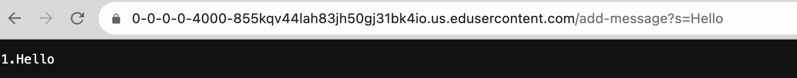
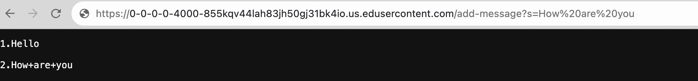
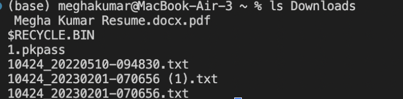
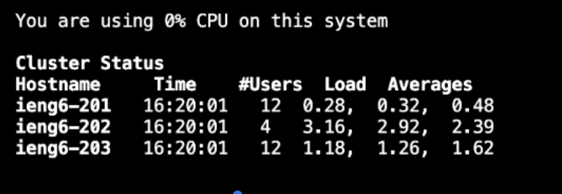

# Lab Report 2: Servers and SSH Keys
## Part 1
**StringServer.java code**
```
import java.io.IOException;
import java.net.URI;
class Handler implements URLHandler {
StringBuilder message = new StringBuilder();
public String handleRequest(URI url) {
if (url.getPath().equals("/")) {
return message.toString();
} else {
System.out.println("Path: " + url.getPath());
if (url.getPath().contains("/add-message")) {
String[] parameters = url.getQuery().split("=");
if (parameters[0].equals("s")) {
message.append(parameters[1] + "\n");
return message.toString();
}
  }
      return "404 Not Found!";
    }
  }
}
class NumberServer {
public static void main(String[] args) throws IOException {
if(args.length == 0){
System.out.println("Missing port number! Try any number between 1024 to 4
return;
}

int port = Integer.parseInt(args[0]);
Server.start(port, new Handler());

  }
}
```
**Running the Server**



Initially, the NumberServer.java file is executed, initiating its main method. 
This main method invokes the Server, as provided in the initial code for Lab 2. 
Within the Server.java file, there's an URLHandler interface, a ServerHttpHandler class, and a Server class, all utilizing Java's HttpServer built-in functionality. 
The Server class is responsible for creating and launching a new HttpServer instance, thereby establishing the web server that becomes accessible.
Moving on to the StringServer.java file, a StringBuilder instance named message is constructed, and the handleRequest() method is executed. 

This method processes the server's URL as a URI object, dissecting it into two main components: the path and the query. 
It examines the path, which is the segment following the hostname and preceding the "?", for any pertinent instructions or strings, specifically looking for "add-message". 
Upon finding this specific string in the path, it then scrutinizes the query part, which follows the "?", for the text to be appended to the message field. 
Additionally, it incorporates a new line character ```"\n"``` to ensure that each subsequent string added begins on a new line.



This screenshot works almost identically to the prior one, with the distinctions lying in the URI value and the altered message field value. The server URL's query is modified, as is the string designated to be added (following the "s="). Furthermore, within the message field, rather than substituting the existing value in the StringBuilder object, an additional string along with a new line is appended.

## Part 2




## Part 3

In the Week 2 Lab, I learned to set up a basic server locally and remotely which was a new experience for me. I gained skills with server setup, executing commands, and remote operation. I also learned that on a remote host, changes made by any user are saved and visible to all. I also learned that every server has a port, which is a number and often hidden.


